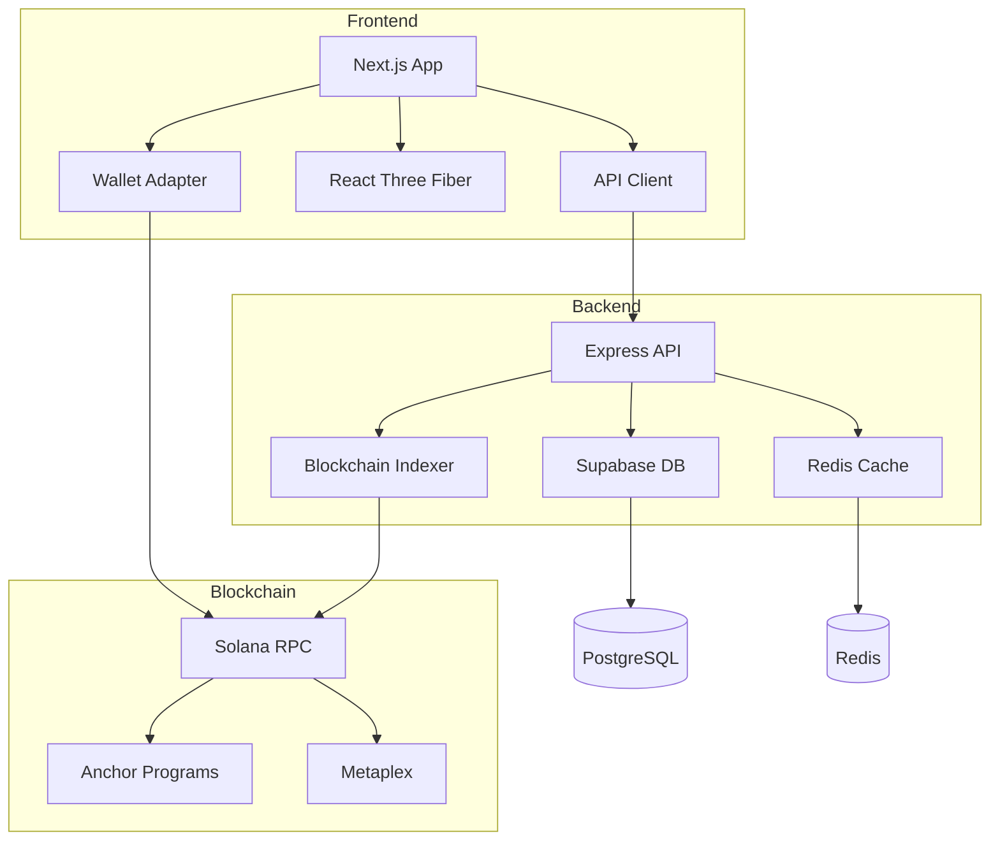

# 🏰 Empire Blocks

A decentralized strategy game built on Solana where players mint territories, form empires, and battle for dominance on a massive 100x100 grid.


---

## 📖 Table of Contents

- [Overview](#overview)
- [Features](#features)
- [Architecture](#architecture)
- [Tech Stack](#tech-stack)
- [Getting Started](#getting-started)
  - [Prerequisites](#prerequisites)
  - [Frontend Setup](#frontend-setup)
  - [Backend Setup](#backend-setup)
- [Development](#development)
- [Deployment](#deployment)
- [Project Structure](#project-structure)
- [Security](#security)
- [Contributing](#contributing)
- [License](#license)

---

## 🎯 Overview

Empire Blocks is a blockchain-based strategy game where players:
- **Mint territories** as NFTs on the Solana blockchain
- **Build empires** by grouping adjacent territories
- **Battle opponents** using a deterministic battle system
- **Trade territories** on an integrated marketplace
- **Earn $EMPIRE tokens** through gameplay and victories

The game features a persistent 10,000-tile grid (100x100) where every territory is unique, tradeable, and permanently stored on-chain.

---

## 🎮 Features

### Blockchain Features
- ✅ **NFT Territories**: Each territory is a unique Metaplex NFT
- ✅ **On-chain State**: All game state stored on Solana
- ✅ **Wallet Integration**: Support for Phantom, Solflare, and other Solana wallets
- ✅ **Mainnet & Devnet**: Production ready with beta testing environment

### Gameplay Features
- ✅ **Territory Minting**: Mint any available territory on the grid
- ✅ **Empire Building**: Group adjacent territories for bonuses
- ✅ **Deterministic Battles**: Fair, verifiable combat system
- ✅ **Real-time Updates**: Live grid updates via WebSocket
- ✅ **Player Dashboard**: Track stats, territories, and battles
- ✅ **Marketplace**: Buy, sell, and trade territories

### Visual Features
- ✅ **3D Grid Visualization**: Interactive Three.js grid
- ✅ **Network Banner**: Clear mainnet/devnet indicators
- ✅ **Responsive Design**: Mobile-friendly interface
- ✅ **Smooth Animations**: Framer Motion powered UI

---

## 🏗️ Architecture



### Component Overview

**Frontend** (`empire-blocks-frontend/`)
- Next.js 14 with App Router
- Solana wallet integration
- 3D territory grid visualization
- Real-time battle system UI

**Backend** (`empire-blocks-backend/`)
- Express.js REST API
- Blockchain event indexer
- Supabase database integration
- Redis caching layer

**Smart Contracts** (Solana Anchor)
- Territory minting via Metaplex
- Empire management
- Battle resolution
- Marketplace logic

---

## 💻 Tech Stack

### Frontend
- **Framework**: Next.js 14 (App Router, TypeScript)
- **Blockchain**: @solana/web3.js, @coral-xyz/anchor
- **Wallet**: @solana/wallet-adapter-react
- **Styling**: Tailwind CSS
- **3D Graphics**: React Three Fiber, Three.js
- **Animations**: Framer Motion
- **State**: Zustand
- **HTTP Client**: Axios

### Backend
- **Runtime**: Node.js 18+
- **Framework**: Express.js
- **Database**: Supabase (PostgreSQL)
- **Cache**: Redis (ioredis)
- **Blockchain**: @solana/web3.js, @coral-xyz/anchor
- **Security**: Helmet, CORS, Rate Limiting
- **Logging**: Winston

### Infrastructure
- **Blockchain**: Solana (Mainnet & Devnet)
- **NFT Standard**: Metaplex
- **RPC Provider**: Mainnet RPC with retry logic
- **Image Storage**: Arweave (via Metaplex)

---

## 🚀 Getting Started

### Prerequisites

- **Node.js** 18 or higher
- **npm** or **yarn**
- **Git**
- **Solana Wallet** (Phantom, Solflare, etc.)
- **PostgreSQL** (via Supabase)
- **Redis** (optional, for caching)

For beta testing:
- Devnet SOL from [Solana Faucet](https://faucet.solana.com)

---

### Frontend Setup

```bash
# Clone the repository
git clone https://github.com/Oussasuna/empire-block.git
cd empire-block

# Navigate to frontend (on main branch)
git checkout main

# Install dependencies
npm install

# Create environment file
cp .env.example .env.local
```

**Environment Variables** (`.env.local`):

```env
# Network Configuration
NEXT_PUBLIC_SOLANA_NETWORK=mainnet-beta  # or 'devnet' for testing
NEXT_PUBLIC_SOLANA_RPC_URL=https://your-rpc-endpoint.com

# Smart Contract
NEXT_PUBLIC_PROGRAM_ID=YOUR_PROGRAM_ID_HERE

# Token
NEXT_PUBLIC_EMPIRE_TOKEN_MINT=YOUR_TOKEN_MINT_HERE

# Backend API
NEXT_PUBLIC_API_URL=http://localhost:3001

# Beta Mode (optional)
NEXT_PUBLIC_IS_BETA=false
```

**Run Frontend**:

```bash
# Development (mainnet)
npm run dev

# Development (devnet/beta)
npm run dev:beta

# Production build
npm run build
npm run start
```

Frontend will run on **http://localhost:3000**

---

### Backend Setup

```bash
# Navigate to backend (on backend branch)
git checkout backend

# Install dependencies
npm install

# Create environment file
cp .env.example .env
```

**Environment Variables** (`.env`):

```env
# Server
PORT=3001
NODE_ENV=development

# Solana
SOLANA_RPC_URL=https://your-rpc-endpoint.com
SOLANA_NETWORK=mainnet-beta
PROGRAM_ID=YOUR_PROGRAM_ID_HERE

# Supabase
SUPABASE_URL=https://your-project.supabase.co
SUPABASE_KEY=your-anon-key-here

# Redis (optional)
REDIS_HOST=localhost
REDIS_PORT=6379
REDIS_PASSWORD=

# Logging
LOG_LEVEL=info
```

**Run Backend**:

```bash
# Development
npm run dev

# Production build
npm run build
npm run start

# Run blockchain indexer
npm run indexer
```

Backend will run on **http://localhost:3001**

---

## 🛠️ Development

### Frontend Scripts

```bash
npm run dev              # Start development server (mainnet)
npm run dev:beta         # Start development server (devnet)
npm run build            # Build for production
npm run start            # Start production server
npm run lint             # Run ESLint
```

### Backend Scripts

```bash
npm run dev              # Start development server with hot reload
npm run build            # Compile TypeScript to JavaScript
npm run start            # Start production server
npm run indexer          # Run blockchain event indexer
```

### Running Full Stack Locally

**Terminal 1** - Backend:
```bash
cd empire-blocks-backend
git checkout backend
npm run dev
```

**Terminal 2** - Frontend:
```bash
cd empire-blocks-frontend
git checkout main
npm run dev
```

Visit **http://localhost:3000** to see the application.

---

## 🌐 Deployment

### Frontend Deployment (Vercel)

1. Push to GitHub
2. Connect repository to Vercel
3. Configure environment variables
4. Deploy from `main` branch

### Backend Deployment

**Option 1: Railway/Render**
```bash
# Build
npm run build

# Start
npm run start
```

**Option 2: Docker**
```dockerfile
FROM node:18-alpine
WORKDIR /app
COPY package*.json ./
RUN npm ci --only=production
COPY . .
RUN npm run build
CMD ["npm", "start"]
```

### Database Setup (Supabase)

1. Create a new Supabase project
2. Run migrations from `schema.sql`
3. Configure connection in `.env`

### Redis Setup

For production caching:
- Use Upstash, Redis Cloud, or self-hosted Redis
- Configure connection in `.env`

---

## 📁 Project Structure

### Frontend (`main` branch)

```
empire-blocks-frontend/
├── src/
│   ├── app/                    # Next.js App Router
│   │   ├── page.tsx           # Home page with grid
│   │   ├── battles/           # Battle system pages
│   │   ├── marketplace/       # Marketplace pages
│   │   └── leaderboard/       # Leaderboard page
│   ├── components/
│   │   ├── Grid/              # 3D grid visualization
│   │   ├── Dashboard/         # Player dashboard
│   │   ├── Territory/         # Territory components
│   │   ├── Marketplace/       # Marketplace UI
│   │   └── UI/                # Shared UI components
│   ├── hooks/                 # Custom React hooks
│   │   ├── useBattle.ts      # Battle system logic
│   │   ├── useTerritory.ts   # Territory management
│   │   └── useWallet.ts      # Wallet integration
│   ├── lib/
│   │   ├── battle/            # Battle system
│   │   ├── metaplex/          # NFT minting
│   │   └── solana/            # Blockchain config
│   ├── store/                 # Zustand stores
│   └── utils/                 # Utility functions
├── public/                    # Static assets
└── package.json
```

### Backend (`backend` branch)

```
empire-blocks-backend/
├── src/
│   ├── config/                # Configuration
│   │   └── index.ts          # Environment config
│   ├── controllers/           # Request handlers
│   │   ├── grid.ts           # Grid endpoints
│   │   ├── player.ts         # Player endpoints
│   │   ├── battle.ts         # Battle endpoints
│   │   └── marketplace.ts    # Marketplace endpoints
│   ├── services/              # Business logic
│   │   ├── solana.ts         # Blockchain service
│   │   └── supabase.ts       # Database service
│   ├── routes/                # API routes
│   │   └── index.ts          # Route definitions
│   ├── utils/                 # Utilities
│   │   └── logger.ts         # Winston logger
│   ├── index.ts              # Express server
│   └── indexer.ts            # Blockchain indexer
└── package.json
```

---

## 🔐 Security

### Production Security
- ✅ Helmet.js for HTTP headers
- ✅ CORS configured for frontend origin
- ✅ Rate limiting on API endpoints
- ✅ Environment variable validation
- ✅ Secure RPC connections
- ✅ Input validation and sanitization

### Beta Testing Security
- ✅ Devnet-only transactions (no real money)
- ✅ Network indicators prevent mainnet confusion
- ✅ Rate limiting prevents spam
- ✅ Client-side transaction validation

**⚠️ Important**: Never commit `.env` files or private keys to version control.

---

## 🐛 Reporting Issues

If you encounter bugs:

1. Check existing issues on GitHub
2. Note steps to reproduce
3. Include:
   - Browser/Node.js version
   - Network (mainnet/devnet)
   - Transaction signatures
   - Console errors
   - Screenshots if applicable

---

## 🤝 Contributing

Contributions are welcome! Please:

1. Fork the repository
2. Create a feature branch (`git checkout -b feature/amazing-feature`)
3. Commit your changes (`git commit -m 'Add amazing feature'`)
4. Push to the branch (`git push origin feature/amazing-feature`)
5. Open a Pull Request

---

## 📄 License

This project is licensed under the MIT License - see the [LICENSE](LICENSE) file for details.

---

## 📞 Support

- **Documentation**: [Link to docs]
- **Discord**: [Link to Discord]
- **Twitter**: [Link to Twitter]
- **Email**: support@empireblocks.com

---

## 🙏 Acknowledgments

- Built with [Solana](https://solana.com/)
- NFTs powered by [Metaplex](https://www.metaplex.com/)
- Frontend framework by [Next.js](https://nextjs.org/)
- 3D graphics with [Three.js](https://threejs.org/)

---

**⚡ Built on Solana | 🎮 Play to Own | 🏆 Battle for Glory**
